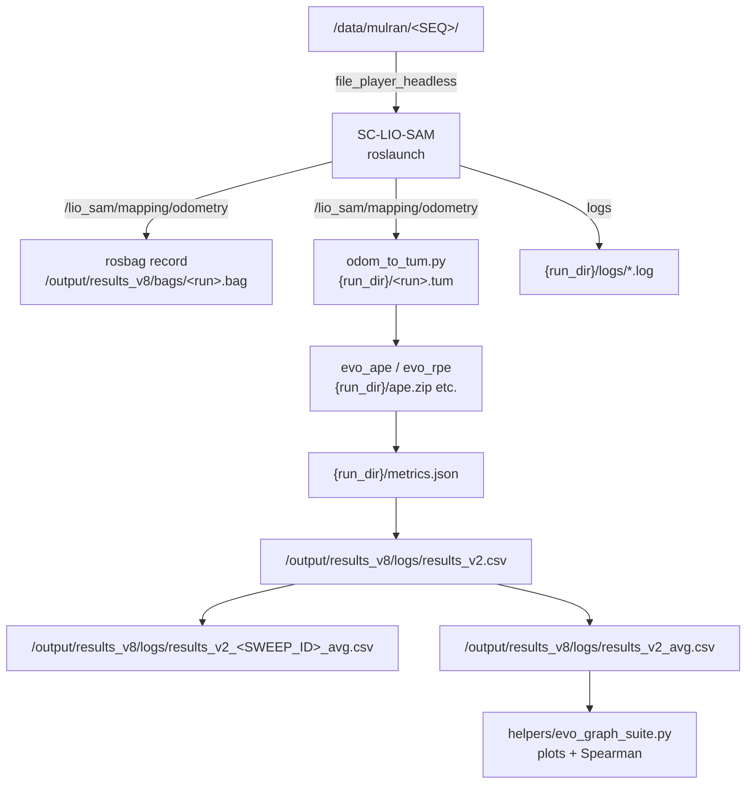

# Hyperparameter Sweep Dataflow

This document traces the complete path from raw MulRan logs through SC-LIO-SAM, evo metrics, CSV aggregation, and the correlation-ready tables consumed by the plotting helpers.

## Stage-by-stage Flow
1. **MulRan data source**  
   - `run_eval_ros1.sh` expects each sequence at `/data/mulran/<SEQ>` and ground-truth trajectories at `/output/gts/<SEQ>_gt.tum`. The GT files can be produced with `mulran_global_pose_to_tum.py`.
2. **Runtime actors (per run)**  
   - `roslaunch lio_sam run_mulran.launch` spins SC-LIO-SAM with IMU pre-integration, ScanContext, and map optimisation.  
   - `file_player_headless` publishes LiDAR/IMU packets and `/clock` at the requested rate and duration.  
   - `rosbag record` captures `/lio_sam/mapping/odometry` so the trajectory can be replayed offline. Bags live under `${OUT_ROOT}/bags/<run_base>.bag`.  
   - `odom_to_tum.py` subscribes to the same odometry topic and writes `${RUN_DIR}/${run_base}.tum`.
3. **Per-run artifacts**  
   - Logs: `${RUN_DIR}/sc_lio.log`, `player.log`, `record.log`, `odom_to_tum.log`.  
   - Parameters: `${RUN_DIR}/params_injected.yaml` (the temp file used for the run) and `lio_sam_params.yaml` (rosparam dump).  
   - Evo outputs: `${RUN_DIR}/ape.zip`, `rpe_trans_1m.zip`, `rpe_trans_1s.zip`, `rpe_rot_1s.zip` plus their `.png` plots and `.log` files.  
   - Metrics: `${RUN_DIR}/metrics.json` (full metadata) and `${OUT_ROOT}/logs/results.jsonl` (append-only log of the same payload).  
   - CSV row: `${OUT_ROOT}/logs/results_v2.csv` receives `timestamp, seq, label, param_hash, rate, duration, full_seq, sweep_id, ape_rmse_m, …, surf_threshold, run_dir, est_bag, est_tum`.
   - Example: `output/results_v8/runs/KAIST01_base_6acbdfa7_20250927-124543/` contains `logs/`, `params_injected.yaml`, and `artifacts/KAIST01_base_6acbdfa7_20250927-124543.tum`, mirroring the structure above.
4. **Aggregation (per sweep)**  
   - The Python footer inside `run_sweep.sh` filters `results_v2.csv` by `sweep_id` and writes:  
     - `${OUT_ROOT}/logs/results_v2_<SWEEP_ID>_avg.csv` (only entries from this sweep).  
     - `${OUT_ROOT}/logs/results_v2_avg.csv` (rolling file covering all sweeps, deduped by `sweep_id`).  
   - Columns retain parameter values (`odom_surf_leaf`, `mapping_corner_leaf`, `mapping_surf_leaf`, `edge_min_valid`, `surf_min_valid`, `edge_threshold`, `surf_threshold`) alongside `*_mean` and `*_std` metrics plus replicate counts.
5. **Optional tidy-up**  
   - `helpers/aggregate_evo_results.py` can rebuild a CSV by scanning `${OUT_ROOT}/logs/*/metrics.json` if `results_v2.csv` was lost.  
   - The newer Python tooling under `mulran_eval/storage.py` records the same information into Parquet tables (`/output/tables/runs.parquet`, `/output/tables/metrics.parquet`) and mirrors `metrics.json` under each `${run_dir}` as well.
6. **Analysis inputs**  
   - `helpers/evo_graph_suite.py --csv /output/results_v8/logs/results_v2.csv` (per-run) or `--csv /output/results_v8/logs/results_v2_<SWEEP_ID>_avg.csv` (aggregated) ingests the tidy data and produces the plots/correlations described in [hyperparameter_sweep_spearman_analysis.md](hyperparameter_sweep_spearman_analysis.md).  
   - `santiago_thesis/Chapter3/spearman_correlations.png` is an example artifact derived from those CSVs.

## File-level Diagram

## Practical Usage Notes
- `OUT_ROOT` defaults to `/output/results_v8`, but you can override it per sweep (`OUT_ROOT=/output/results_v9 ./run_sweep.sh`). Any change automatically propagates to the log folders and CSV paths.
- When running outside Docker, the scripts gracefully fall back to a local `./output` directory if `/output` is read-only.
- Evo ZIPs keep the full statistics dictionary; if later analyses need more than RMSE/SSE, unzip `ape.zip` and read the JSON inside.
- Per-run metadata always includes `sweep_id`, so mixing multiple sweeps into one CSV is safe as long as you filter before aggregating correlations.
