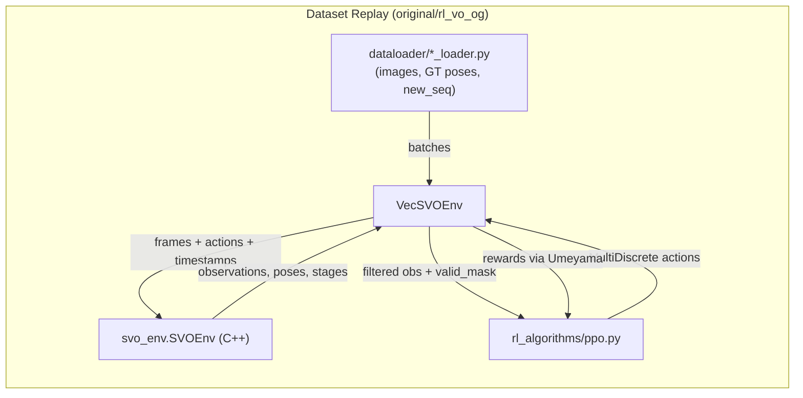
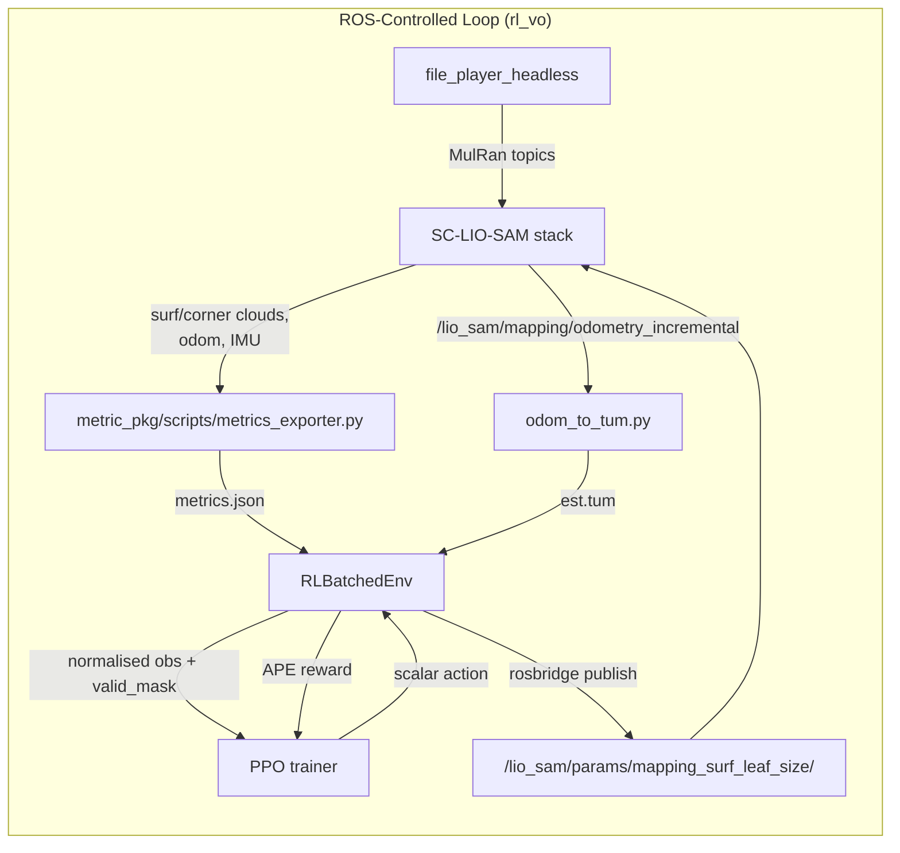

# RL-VO Baseline vs Current Overview

This document contrasts the original **RL-meets-VO** baseline under `original/rl_vo_og` with the LiDAR + SC-LIO-SAM implementation under `rl_vo`. It is the entry point for understanding how the repository evolved from an offline, dataset-driven VO tuning loop to an online ROS-integrated SLAM controller.

## Baseline (original/rl_vo_og)
- **Data source**: batched RGB images + ground-truth poses streamed by the dataset loaders (`dataloader/{tartan,euroc,tum}_loader.py`). Each loader preloads poses, randomises trajectories, and emits `(images, poses, new_seq_mask)` batches to `VecSVOEnv`.
- **Environment**: `VecSVOEnv` (`original/rl_vo_og/env/svo_wrapper.py`) wraps the compiled `svo_env.SVOEnv`, tracks up to 100 parallel environments, and keeps sliding buffers of poses for alignment. It only forwards actions to SVO once the tracker reaches stage 2 (valid state).
- **Observations**: Fixed block of 24 scalars (keyframe timing, stage flags, keypoint stats) plus 180×3 variable tokens filled by SVO. The critic receives an extra 7-D tail derived from consecutive GT poses (`add_critique_observations`).
- **Actions**: Two-dimensional `MultiDiscrete([2,5])`. After scaling, the agent picks whether to trigger a keyframe (`{0,1}`) and selects a grid size in `{20,25,30,35,40}` cells. Actions flow directly into `svo_env.step`.
- **Reward**: Uses `align_umeyama` over a window of buffered poses to align predicted vs GT trajectories and reward small translation errors, minus a penalty proportional to the first action (keyframe rate). Alignment buffers are maintained per env (`update_alignment_buffer`).
- **Training loop**: `train.py` instantiates `VecSVOEnv` with `n_envs=100`, collects `n_steps=250` per rollout, batches 25 000 samples per PPO update, and discounts rewards with `gamma=0.6`. Evaluation replays held-out trajectories via the same VecEnv stack.

## Current LiDAR + SC-LIO-SAM System (rl_vo)
- **Data source**: Real-time ROS topics generated by MulRan file playback + SC-LIO-SAM. `EpisodeOrchestrator` (`rl_vo/env/episode_orchestrator.py`) keeps the ROS core up, restarts SC-LIO-SAM + `odom_to_tum.py` + the file player per episode, and samples MulRan sequences/start offsets from config.
- **Environment**: `RLBatchedEnv` (`rl_vo/env/rl_env.py`) (typically `n_envs=1`) publishes PPO actions to `/lio_sam/params/mapping_surf_leaf_size`, triggers `/rl_metrics/{reset,commit}` through rosbridge, and builds observations from `metric_pkg/scripts/metrics_exporter.py`.
- **Observations**: 16 fixed scalars (point counts, odom/scan rates, IMU RMS, dropouts, last action), up to `max_tokens=64` × `variable_feature_dim=3` variable tokens `[surf_pts, corner_pts, vel_norm]`, and a 4-D critic tail assembled from redundant rate/dropout stats. All channels are normalised via `RunningMeanStdLite`.
- **Actions**: Single scalar in `[0,1]` mapped logarithmically to `[5e-4, 1.0]` m leaf sizes by `action_to_leaf`. The scaled value is published through rosbridge and echoed back into metrics as `action_last`.
- **Reward**: `ape_rmse` (`env/utils/ape.py`) over the last `score_win_s` seconds between `est_tum` and MulRan GT drives the main term (`0.1 * -APE`), with small runtime and action-smoothing penalties. Steps without valid metrics or GT set `valid_mask=False`.
- **Training loop**: `rl_vo/train.py` runs PPO with `n_envs=1`, `n_steps=128`, `batch_size=64`, `gamma=0.99`, and `ent_coef=0.01`. Rollouts are much shorter but every sample corresponds to a full ROS episode tick; validation spins a second `RLBatchedEnv` configured for held-out sequences.

## Structural Differences

| Dimension | Baseline RL-meets-VO | Current SC-LIO-SAM RL |
| --- | --- | --- |
| **Sensor modality** | Monocular images fed to `svo_env` | LiDAR + IMU metrics aggregated from SC-LIO-SAM |
| **Environment core** | `VecSVOEnv` batching 100 simulated VO runs | `RLBatchedEnv` orchestrating real ROS processes |
| **Observation layout** | 24 fixed stats + 180×3 SVO feature tokens + 7-D GT-derived critic tail | 16 fixed stats + 64×3 LiDAR tokens + 4-D critic tail from ROS metrics |
| **Action space** | Binary keyframe trigger + discrete grid size | Continuous leaf size (log-scaled) |
| **Reward signal** | Sliding-window alignment against GT positions (Umeyama) + keyframe penalty | Rolling APE RMSE from TUM logs + runtime/action penalties |
| **Parallelism** | 100-vectorised envs, dataloader-driven | 1 (or a handful) of ROS-backed envs due to process cost |
| **Reset path** | Dataset iterator wraps and `svo_env.reset` resets trackers | ROS actors restarted per MulRan playback; core stays alive |

## Baseline Pipeline

## Current Pipeline

Use this overview to orient yourself before diving into the per-dimension comparisons in the companion documents.
