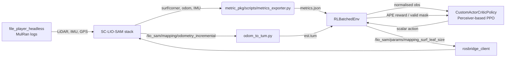

# RL-VO Contributions Summary

The following sections enumerate the key contributions introduced by the LiDAR + SC-LIO-SAM adaptation relative to the RL-meets-VO baseline. Each bullet highlights the concrete implementation site so the claims can be traced directly to the code.

## Data Collection & Training Loop
- Replaced offline batched image streams with live MulRan playback and ROS-mediated data collection (`rl_vo/env/episode_orchestrator.py`), ensuring the RL agent now trains on the same asynchronous signals it will see at deployment.
- Collapsed PPO rollouts from 25 000-sample batches driven by 100 vectorised SVO mini-simulations (`original/rl_vo_og/train.py`) to tightly coupled 128-step rollouts that respect real ROS timing and failure modes (`rl_vo/train.py` + `RLBatchedEnv.step`).
- Introduced validity-aware masking driven by actual metric/GT availability (`RLBatchedEnv.step` → `valid_mask`) rather than relying solely on VO stage flags; this keeps PPO on-policy even when ROS actors stall.

## Environment & Orchestration
- Replaced the monolithic in-process `VecSVOEnv` with a ROS-native orchestrator that keeps rosbridge + metrics exporter persistent while restarting SC-LIO-SAM, file players, and odom loggers per episode (`env/episode_orchestrator.py`).
- Added resilient restart logic (`RLBatchedEnv.step`) that immediately respawns ROS actors when MulRan playback completes or rosbridge dies, minimising dead time between PPO trajectories without sacrificing state isolation.
- Embedded rosbridge service/publish helpers (`env/rosbridge_client.py`) so the RL process never joins the ROS graph, improving modularity and simplifying dry-run testing.

## Transformer / Model Architecture
- Retained the attention-based `CustomActorCriticPolicy` but resized encoder kwargs at runtime from ROS metrics (`rl_vo/train.py:45-64`), enabling the same architecture to consume smaller token counts with different semantics without code divergence.
- Normalised the entire observation vector—including variable tokens and critic tail—using `RunningMeanStdLite` (`rl_vo/env/rl_env.py`), whereas the baseline only normalised fixed stats. This mitigates scale drift introduced by LiDAR-derived metrics and keeps the Perceiver stable.

## Data Types, Observations, and Actions
- Pivoted the observation space from SVO-derived keypoint grids + GT residuals to SC-LIO-SAM metrics exported via `metric_pkg/scripts/metrics_exporter.py`, capturing LiDAR surf/corner densities, odom cadence, IMU RMS, and recent actions.
- Simplified the action space from a two-headed `MultiDiscrete` (keyframe trigger and grid index) to a physically interpretable scalar that logarithmically controls `mapping_surf_leaf_size` (`rl_vo/env/rl_env.py::action_to_leaf`), aligning the control variable with SC-LIO-SAM’s tunable parameter.
- Ensured the critic tail is built from redundant ROS stats rather than future GT poses, making the value function estimate attainable during deployment (no dependence on unseen future frames).

## Reward & Hyperparameters
- Replaced Umeyama-based translation rewards with rolling APE RMSE computed from `odom_to_tum.py` outputs (`env/utils/ape.py`), directly tying PPO’s objective to the SLAM quality metric used in downstream evaluation.
- Added runtime (`0.001 * runtime_s`) and action-smoothness (`0.01 * |Δaction|`) penalties to discourage policies that destabilise SC-LIO-SAM or spam leaf-size oscillations.
- Rescaled PPO hyperparameters to suit expensive ROS rollouts: `gamma=0.99`, `n_steps=128`, `batch_size=64`, and `ent_coef=0.01` (see `rl_vo/config/config.yaml`), improving sample efficiency under real-time constraints.

## Integration with LiDAR + SC-LIO-SAM + ROS
- Established a full ROS feedback loop: file_player → SC-LIO-SAM → metrics exporter → `RLBatchedEnv` → rosbridge → SC-LIO-SAM. Every hop is implemented inside the repo (`rl_vo/launch/*.launch`, `metric_pkg/scripts/metrics_exporter.py`, `env/rosbridge_client.py`).
- Added MulRan-specific randomisation (sequence selection + start-percent sampling) in `EpisodeOrchestrator.begin_episode`, expanding the distribution of trajectories encountered during training beyond what the baseline TartanAir/EuRoC datasets offered.
- Documented the entire interaction surface (topics, services, parameters) and exposed dry-run hooks so experiments can be staged without full ROS stacks (`MockRosbridge`, synthetic GT writers).

## Big-Picture Diagram

Together these changes transform RL-meets-VO’s offline SVO tuner into a thesis-ready, ROS-native reinforcement learning system that targets LiDAR SLAM quality directly.
