# Data Collection & Training Loop Differences

This note expands on how rollouts and PPO updates differ between the original `original/rl_vo_og` implementation and the current `rl_vo` stack. It focuses on where states, rewards, and dones come from, how `VecEnv` instances are stepped, and how PPO consumes those samples.

## Baseline: Dataset-Driven VecEnv + SVO

1. **Batch loading** (`original/rl_vo_og/dataloader/*.py`):
   - Each loader precomputes trajectory lists, randomises indices for `num_envs`, and returns `(images, poses, new_seq_mask)` every call.
   - Images are resized/converted to grayscale and fetched as contiguous batches (`svo_env.load_image_batch`).
2. **Environment step** (`original/rl_vo_og/env/svo_wrapper.py`):
   - `VecSVOEnv.step` converts the `MultiDiscrete([2,5])` PPO actions into physical controls (keyframe trigger + grid size) via `action_space_scale`.
   - Calls `svo_env.step(images, timestamps, action, use_RL_actions, use_gt_init_poses, gt_init_poses)` which advances SVO synchronously for all envs.
   - Keeps sliding buffers of predicted and GT poses so that alignment windows can be computed once sufficient steps have passed (`update_alignment_buffer`).
   - Marks `valid_stages = svo_stage == 2` so PPO ignores frames where SVO is still relocalising or initialising.
3. **Reward/done**:
   - `compute_reward` aligns buffered predictions with GT (Umeyama) once `env_steps > reward_nr_points_for_align`, yielding a translation error reward and a keyframe penalty (`-action[:,0] * keyframe_coef`).
   - `dones = svo_dones ∨ new_seq_mask` so either SVO itself or the dataset boundary ends an episode. `reset_dones` selectively resets only the finished slots.
4. **Rollout formation**:
   - `original/rl_vo_og/train.py` sets `n_envs=100`, `n_steps=250`, so each rollout collects 25k transitions before PPO updates.
   - `VecSVOEnv` normalises only the first 24 observation channels (`RunningMeanStd`), leaving the 180×3 variable block untouched because it already contains sparse SVO features.

## Current System: ROS-Orchestrated Single-Env Loop

1. **Episode orchestration** (`rl_vo/env/episode_orchestrator.py`):
   - `begin_episode` ensures the persistent ROS core (rosbridge + metrics exporter) is up, restarts the SC-LIO-SAM stack, launches `odom_to_tum.py`, and starts `file_player_headless` at a random sequence/start percentage.
   - On reset it publishes a safe leaf size (0.40 m) and calls `/rl_metrics/reset`.
2. **Environment step** (`rl_vo/env/rl_env.py`):
   - `RLBatchedEnv.step` clips the PPO scalar to `[0,1]`, log-scales it via `action_to_leaf`, and publishes it over rosbridge.
   - Calls `EpisodeOrchestrator.tick(step_len_s)` (default 1 s) so ROS advances for real time, then triggers `/rl_metrics/commit` to fetch the latest JSON snapshot.
   - Observations combine fixed stats, padded `variable_tokens`, and a critic tail before normalisation (`RunningMeanStdLite` over the entire vector).
   - Validity requires both metrics and GT: if `variable_tokens_n == 0` or GT file is missing, the step gets `valid_mask=False`.
3. **Reward/done**:
   - Reward uses `ape_rmse(est_tum, gt_tum, score_last_seconds=self.score_win_s)` plus runtime/action penalties. `valid_mask=False` suppresses contributions to PPO when APE cannot be computed.
   - Episode termination occurs when the ROS player ends, rosbridge dies, or a max-step horizon is reached. Instead of tearing down ROS, the orchestrator restarts only the LIO stack + actors and immediately emits the first observation of the next episode (PPO sees `done=True` with a fresh obs).
4. **Rollout formation**:
   - `rl_vo/train.py` typically runs `n_envs=1`, `n_steps=128`, producing 128-step rollouts that mirror ~128 s of ROS wall time.
   - `MaskedRolloutBuffer` stores the single-env transitions along with `valid_mask` and ensures PPO samples only valid indices.

## Training Hyperparameters & Control Flow

| Aspect | Baseline (`original/rl_vo_og/config/config.yaml`) | Current (`rl_vo/config/config.yaml`) |
| --- | --- | --- |
| `n_envs` | 100 parallel VecEnv slots | 1 (optionally a few for evaluation) |
| `n_steps` | 250 | 128 |
| `batch_size` | 25 000 (entire rollout) | 64 |
| `gamma` | 0.6 (short horizon to emphasise immediate VO drift) | 0.99 (longer continuity, necessary for ROS delays) |
| `gae_lambda` | 0.95 | 0.95 |
| `ent_coef` | 0.0025 | 0.01 |
| `vf_coef` | 0.5 | 0.5 |
| `max_grad_norm` | 0.5 | 0.5 |
| `reward shaping` | Alignment reward + keyframe penalty | `-0.1*APE - 0.001*runtime - 0.01*|Δaction|` |
| Evaluation | Vectorised EuRoC/Tartan loaders; `evaluation_epoch` visualises sequences | `evaluation_epoch_sclsam` spins the ROS env deterministically and logs APE/timeouts |

### Control-Flow Contrast
- **Baseline**: `collect_rollouts` advances all 100 env slots in lockstep, each time popping the next dataset frame and running `svo_env.step`. SVO runtime is deterministic, so PPO sees uniformly spaced 30 Hz transitions with minimal I/O latency.
- **Current**: Each `step` wraps a real ROS tick (including publishing, waiting for metrics, and writing `est.tum`). Observations arrive irregularly if ROS stalls, so `valid_mask` is critical to prevent stale steps from corrupting the PPO update.
- **Buffering**: Baseline keeps separate pose and scale buffers for alignment, while the current env relies on SC-LIO-SAM and `odom_to_tum` to expose odometry segments and does not maintain internal history beyond the latest metrics snapshot.
- **Seeding & determinism**: The dataset loop can reset its iterator deterministically; ROS introduces nondeterministic latencies, so `RLBatchedEnv` leans on runtime checks (`player_alive`/`comms_alive`) to restart actors whenever the underlaying processes diverge.

## Rollout vs PPO Update Diagram

```mermaid
flowchart TB
    %% Baseline PPO
    subgraph Baseline["Baseline PPO Cycle"]
        DL["dataloader batch<br/>(images, gt poses)"] --> SVOEnv["VecSVOEnv<br/>(svo_env)"]
        SVOEnv -->|"obs, reward, done,<br/>valid_stage"| BufferA["MaskedRolloutBuffer"]
        BufferA -->|"n_steps=250 × n_envs=100"| PPOA["PPO.train()"]
        PPOA -->|"actions (MultiDiscrete)"| SVOEnv
    end

    %% Current PPO
    subgraph Current["Current PPO Cycle"]
        Orchestrator["EpisodeOrchestrator<br/>ROS actors"] --> Env["RLBatchedEnv"]
        Env -->|"obs, reward, done,<br/>valid_mask"| BufferB["MaskedRolloutBuffer"]
        BufferB -->|"n_steps=128 × n_envs=1"| PPOB["PPO.train()"]
        PPOB -->|"scalar action"| Env
        Env -->|"rosbridge publish"| Orchestrator
    end

    %% Styles (use subgraph IDs, no spaces)
    style Baseline fill:#f8fbff,stroke:#7aa2ff
    style Current fill:#f6fff8,stroke:#7ec27a
```

Use this file with `docs/rl_vo_envs_diff.md` for environment internals and `docs/rl_vo_model_and_datatypes_diff.md` for observation/action semantics.
