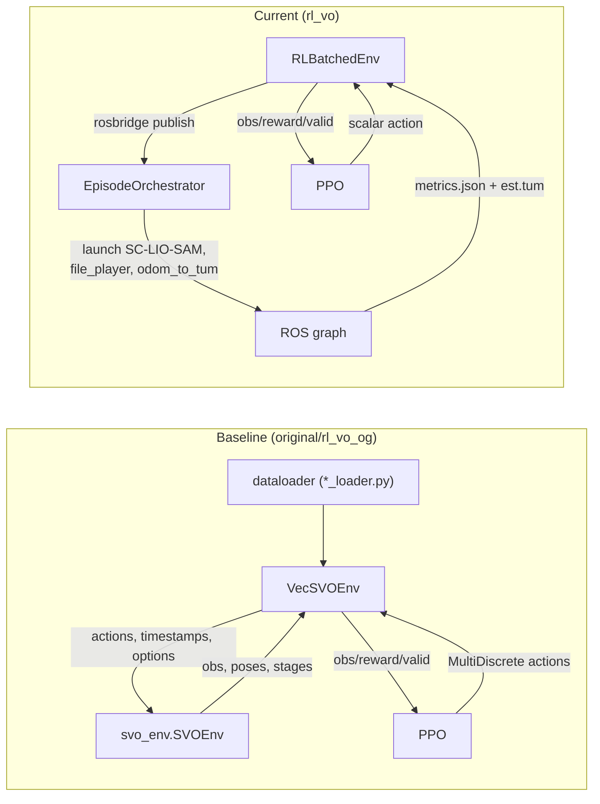

# Environment Architecture Differences

`original/rl_vo_og/env/svo_wrapper.py` and `rl_vo/env/rl_env.py` both implement `VecEnv`, yet they wrap radically different systems. This document dives into how each environment initialises, resets, steps, constructs observations, and applies actions to the underlying VO / SLAM stack.

## Baseline `VecSVOEnv` (`original/rl_vo_og/env/svo_wrapper.py`)
- **Initialisation**:
  - Accepts dataset paths, calibration/parameter YAMLs, number of parallel envs, and reward configuration.
  - Instantiates `svo_env.SVOEnv` (C++) with the requested `num_envs` and loads the appropriate dataset loader (`TartanLoader`, `EurocLoader`, `TumLoader`).
  - Preallocates buffers for timestamps, env steps, predicted poses, GT poses, and short windows used for scale/alignment rewards.
- **Reset logic**:
  - `reset()` calls `self.env.reset` for every slot, fetches the first `(images, gt_poses, new_seq)` batch, and performs a dummy SVO step with zero actions to obtain initial observations.
  - Ground-truth poses are split into current/next entries so `add_critique_observations` can compute translation/rotation deltas (only used for critic training).
- **Step logic**:
  - Converts PPO actions using `self.action_space_scale`: binary keyframe trigger and integer grid size (`np.asarray([[1,0],[5,20]])`).
  - Requests a new batch from the dataloader, forwards it to `svo_env.step`, and handles per-slot resets when `svo_dones` or dataset boundaries occur.
  - Tracks `svo_stages` and only treats stage 2 (normal tracking) as valid; invalid slots get zeroed observations except for the keyframe-distance channel.
- **Observation construction**:
  - Combines the SVO-provided vector with GT-derived critique entries (translation delta, rotation vector, position error).
  - Normalises the first 24 entries using `RunningMeanStd`; the variable 180×3 block and critique tail remain unnormalised.
- **Action application**:
  - `self.env.step` consumes the scaled action array. `use_RL_actions` masks out slots that have not yet reached a valid SVO stage, preventing the policy from perturbing the tracker during initialisation.
- **Termination & info**:
  - Dones arise from either `svo_env` or dataloader resets. Info dicts include raw images, predicted/GT poses, VO stage, and per-slot reward terms (`position_reward`, `keyframe_reward`).

## Current `RLBatchedEnv` (`rl_vo/env/rl_env.py`)
- **Initialisation**:
  - Loads MulRan + roslaunch config from Hydra, seeds Python/NumPy RNGs, and builds observation space dimensions from `_fixed_keys`, `tokens.max_tokens`, and `critique_dim`.
  - Sets up a `RosbridgeClient` (or `MockRosbridge` in `DRY_RUN`) and an `EpisodeOrchestrator` that supervises roslaunch, SC-LIO-SAM stack restarts, and MulRan file playback.
- **Reset logic**:
  - Picks a random sequence/start percent, calls `EpisodeOrchestrator.begin_episode`, publishes a safe leaf size, and waits (up to 1 s) for metrics to become available.
  - Returns the first normalised observation; if metrics have not appeared yet, `self._pending_rms_update` defers RMS updates until real data arrives.
- **Step logic**:
  - Clips the PPO scalar to `[0,1]`, converts it to metres via `action_to_leaf`, publishes over rosbridge, then blocks for `step_len_s` while ROS executes.
  - After the tick, it checks whether the file player or rosbridge died and, if so, restarts the episode actors while keeping the ROS core alive.
  - Otherwise, it fetches metrics via `/rl_metrics/commit`, builds the observation (fixed stats + padded `variable_tokens` + critic tail), and normalises the entire vector.
- **Observation construction**:
  - Fixed stats mirror the keys emitted by `metric_pkg/scripts/metrics_exporter.py`. The variable block is a flattened `(max_tokens, variable_feature_dim)` array of `[surf_pts, corner_pts, vel_norm]` triples.
  - The critic tail is either taken directly from metrics (`critique_tail`) or synthesised from redundant stats when missing.
  - `RunningMeanStdLite` updates whenever real metrics arrive, covering all channels (fixed + variable + tail).
- **Action application**:
  - Only one action exists; it is pushed to `/lio_sam/params/mapping_surf_leaf_size` via rosbridge. The action is also stored in `_last_action` so the environment can penalise large deltas and echo the value back into the next observation.
- **Termination & info**:
  - `done=True` is raised when ROS actors exit or a configurable `max_steps` horizon is reached. Instead of returning terminal observations, the env immediately restarts the actors to minimise downtime.
  - Info dict exposes runtime, APE, applied leaf size, and the reason for termination (`player_ended`, `ros_down`, or `max_steps`).

## Key Differences

| Aspect | `VecSVOEnv` | `RLBatchedEnv` |
| --- | --- | --- |
| **Underlay** | C++ `svo_env` inside the process | External ROS nodes supervised by `EpisodeOrchestrator` |
| **Data feed** | Python dataloaders streaming images & GT | MulRan file player publishing LiDAR/IMU into ROS |
| **Valid-state detection** | SVO stage (`stage == 2`) | Availability of metrics + GT alignment |
| **Action gating** | `use_RL_actions` switches RL control off during initialisation | Always applies action; safety handled by publishing a default value before resets |
| **Observation tail** | Critic-only GT deltas (position + rotation) | Critic-only derived ROS stats (odom rate, dropouts, scan rate, point count) |
| **Parallelism** | Vectorises over 100 slots per process | Typically single environment (ROS startup cost is high) |
| **Reset granularity** | Per-slot resets; dataset iterator wraps independently for each env | Whole episode actors restart together, ROS core persists |

## Environment Stack Diagram

Consult `docs/rl_vo_data_and_training_loop_diff.md` for rollout control flow and `docs/rl_vo_model_and_datatypes_diff.md` for how observations/actions feed the shared Perceiver-based policy.
