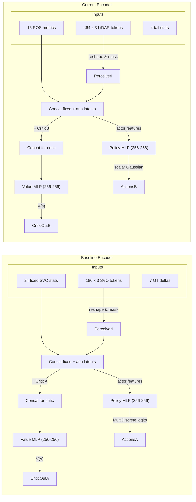

# Model, Attention, and Data-Type Differences

Both implementations share the `CustomActorCriticPolicy` (`policies/attention_policy.py`) yet the modalities they ingest, the semantics of each observation slice, and the actions/rewards they optimise differ substantially. This document summarises those differences so the transformer encoder and PPO settings can be interpreted correctly in each context.

## Transformer / Attention Usage

| Component | Baseline (`original/rl_vo_og`) | Current (`rl_vo`) |
| --- | --- | --- |
| **Encoder** | `PerceiverI` attends over 180 tokens × 3 features emitted directly by `svo_env` per frame (`agent_obs_dim_variable = 180 * 3`). | Same `PerceiverI` attends over up to 64 LiDAR tokens × 3 features assembled by `metric_pkg` (`tokens.max_tokens` × `tokens.variable_feature_dim`). |
| **Fixed block** | 24 scalars provided by SVO (keyframe distance, number of tracked features, stage flags, runtime diagnostics). | 16 ROS metrics (point counts, scan/odom rate, IMU RMS, planarity proxy, action last). |
| **Critic tail** | 7 GT-derived channels: `[position_error, Δx, Δy, Δz, rotvec_x, rotvec_y, rotvec_z]` computed from consecutive ground-truth poses during training (`add_critique_observations`). | 4 ROS-derived channels: `[odom_rate_hz, pose_dropouts_s, scan_rate_hz, pts_per_scan_mean]` as reported (or inferred) from `metrics.json`. |
| **Normalisation** | `RunningMeanStd` normalises only the first 24 entries; tokens/critic tail remain in raw SVO scales. | `RunningMeanStdLite` normalises the entire concatenated vector (fixed + tokens + tail) because all features come from the same exporter. |
| **Policy/value heads** | `net_arch=dict(pi=[256,256], vf=[256,256])` with ReLU, same as current. Latent sizes differ because `obs_dim_fixed` and `variable_flattened_dim` differ. | Identical architecture; latent dims shrink because the token count is lower (64 vs 180) but critic tail is shorter. |

## Observation Space Semantics

| Slice | Baseline Content | Current Content |
| --- | --- | --- |
| **Fixed features** | Distances since last keyframe, number of active landmarks per grid, VO runtime counters, SVO stage flags (see `env/utils/visualization.py` for decoded values). | Means/stds of deskewed points, surf/corner counts, scan & odom rate, pose dropout durations, velocity/jolt stats, IMU RMS, planarity ratio, previous action (`rl_vo/env/rl_env.py::_fixed_keys`). |
| **Variable tokens** | 180 slots × 3 floats each; SVO populates them with feature-grid descriptors (e.g., aggregated keypoint statistics) and zeroes unused slots. | Up to 64 slots × 3 floats `[surf_pts, corner_pts, vel_norm]` pulled from `metrics_exporter` and aligned on scan timestamps, zero-padded when fewer scans exist within the window. |
| **Critic tail** | Ground-truth deltas between current and next pose plus instantaneous position error, only when `mode == 'train'`. Not available during validation or inference. | Already provided (or reconstructed) by the metrics exporter, so critic always sees the same four derived signals in both train and eval. |
| **Valid-mask source** | `valid_stages = (svo_stage == 2) ∧ prev_stage_valid`. Observations are zeroed when invalid except for the keyframe distance channel. | A step is valid only if metrics were committed *and* GT exists (i.e., `variable_tokens_n > 0` and GT path is distinct from `est_tum`). Invalid steps are returned but flagged so PPO ignores them. |

## Action & Reward Semantics

| Item | Baseline | Current |
| --- | --- | --- |
| **Action space** | `spaces.MultiDiscrete([2,5])` → `[keyframe_trigger, grid_size_idx]`. After scaling: `keyframe_trigger ∈ {0,1}`, `grid_size ∈ {20,25,30,35,40}` cells. | `spaces.Box(low=0, high=1, shape=(1,))` mapped to `[5e-4, 1.0]` m via logarithmic interpolation before publishing to `/lio_sam/params/mapping_surf_leaf_size`. |
| **Action effects** | Controls SVO’s internal heuristics: the first dimension requests a keyframe, the second adjusts mapping grid resolution (observed in `env/utils/visualization.py`). | Directly reconfigures SC-LIO-SAM’s voxel filters (`mapOptmization::mappingSurfLeafSizeHandler`), shrinking or expanding the surf map used in scan-to-map optimisation. |
| **Reward** | Sliding-window alignment reward: `align_umeyama` aligns buffered predicted positions with GT, penalising translation errors; separate penalty discourages frequent keyframes. | Rolling APE RMSE from `env/utils/ape.py`, minus runtime and action-change penalties. No auxiliary GT information is injected into observations beyond what `odom_to_tum` + metrics exporter provide. |

## Training Data Types

- **Baseline**:
  - Observations originate from SVO’s internal tensors, derived from monocular image sequences plus preloaded GT.
  - Critic tail has access to future GT pose (next frame) during training, enabling richer supervision but limiting transferability outside the dataset domain.
  - Rollouts happen at synthetic 30 Hz; each PPO update uses 25k transitions corresponding to many simultaneous trajectories.
- **Current**:
  - Observations come exclusively from ROS topics (LiDAR point counts, velocities, IMU RMS), summarised by `metric_pkg`. No ground truth is injected beyond what is needed for reward computation.
  - Critic receives redundant copies of slow signals (odom/scan rates, dropouts) to improve value estimates even when the action impacts SC-LIO-SAM gradually.
  - Rollouts are constrained by ROS runtime; each step encapsulates ~1 s of processing and includes actual runtime and action deltas in the reward.

## Architecture Diagram

Use this overview alongside `docs/rl_vo_envs_diff.md` (environment mechanics) and `docs/rl_vo_data_and_training_loop_diff.md` (rollout control flow) when reasoning about model behaviour.
