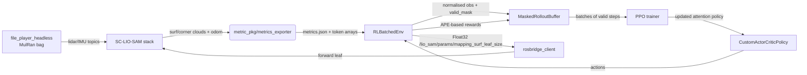

# RL-VO Overview

`rl_vo/` is the in-repo reinforcement learning stack that adapts SC-LIO-SAM in real time by tuning `mappingSurfLeafSize`. The folder reused the historical “RL meets VO” name but houses a custom PPO + attention architecture, ROS-aware environments, and orchestration glue that is tightly coupled to this project’s LiDAR + SC-LIO-SAM pipeline.

## Purpose in the System
- Consume lightweight metrics exported from SC-LIO-SAM and convert them into normalised observations.
- Run PPO with a custom attention backbone that can reason over per-scan feature tokens plus slower context.
- Stream actions through rosbridge to `/lio_sam/params/mapping_surf_leaf_size`, keeping SC-LIO-SAM responsive without modifying its code.
- Track rewards via rolling APE against MulRan ground truth and periodically evaluate/checkpoint the policy.

### Key Files
| Path | Responsibility | Notes |
| --- | --- | --- |
| `rl_vo/train.py` | Hydra entrypoint, builds training + validation `RLBatchedEnv`, wires PPO hyperparameters, resumes checkpoints/RMS stats. | Uses `CustomActorCriticPolicy` with encoder introspected from the env. |
| `rl_vo/env/rl_env.py` | `VecEnv` that keeps ROS core alive, randomises MulRan sequences/start offsets, normalises observations, and shapes rewards. | Wraps `EpisodeOrchestrator`, `RosbridgeClient`, and `RunningMeanStdLite`. |
| `rl_vo/env/episode_orchestrator.py` | Process supervisor for roslaunch, SC-LIO-SAM stack (`launch/lio_stack.launch`), `odom_to_tum.py`, and `file_player_headless`. | Publishes safe actions, runs `/rl_metrics/{reset,commit}`, mirrors logs under `paths.run_root`. |
| `rl_vo/env/rosbridge_client.py` | WebSocket shim that publishes Float32 actions and calls services exposed by rosbridge. | `MockRosbridge` enables DRY_RUN tests without ROS. |
| `metric_pkg/scripts/metrics_exporter.py` | ROS1 node co-located with SC-LIO-SAM that computes all RL observations (fixed stats + per-scan tokens + critique tail). | Receives `mapping_surf_leaf_size` echo to expose `action_last`. |
| `rl_vo/policies/attention_policy.py` | Defines `PerceiverI`, `AttentionNetwork`, and `CustomActorCriticPolicy`. | Splits observations into fixed/variable/critique segments and runs multi-head attention on variable tokens. |
| `rl_vo/rl_algorithms/{ppo.py,on_policy_algorithm.py,buffers.py}` | On-policy training stack derived from SB3 but extended with WANDB hooks, ROS-aware evaluation, and masks for invalid steps. | `MaskedRolloutBuffer` drops steps that lack GT/metrics before PPO updates. |

## Observations, Actions, and Rewards
- **Observation layout (`rl_vo/env/rl_env.py`)**
  - 16 fixed scalars from `metric_pkg/scripts/metrics_exporter.py` (point statistics, odom cadence, IMU RMS, planarity proxy, previous action).
  - Up to `tokens.max_tokens` (default 64) × `tokens.variable_feature_dim` (default 3) variable tokens. Each token packs `[surf_pts, corner_pts, vel_norm]` aligned on scan timestamps; padded slots are zeroed.
  - A 4-D “critique tail” derived from odom and scan rates to give the critic extra context.
  - `RunningMeanStdLite` keeps a process-local normaliser that the env updates whenever real metrics arrive.
- **Action channel**
  - PPO outputs `a ∈ [0,1]`. `action_to_leaf()` logarithmically interpolates between `LEAF_MIN=5e-4` m and `LEAF_MAX=1.0` m so evenly spaced policy outputs translate into meaningful voxel scales.
  - `EpisodeOrchestrator.set_leaf()` sends the scaled Float32 over rosbridge; `metric_pkg` subscribes to the same topic to expose `action_last`.
- **Reward (`RLBatchedEnv.step`)**
  - Uses `env/utils/ape.py::ape_rmse` to compute rolling APE over the last `score_win_s` seconds (default 3 s) between `odom_to_tum.py`’s `est.tum` and the MulRan GT file for the active sequence.
  - Reward = `0.1 * (-APE)` − `0.001 * runtime_s` − `0.01 * |a_t − a_{t-1}|`. If GT is missing or metrics are stale, the env emits `valid_mask=False` so the buffer discards the transition.

## How RL Sits Between SC-LIO-SAM and the Environment

## Architectural Notes
- `RLBatchedEnv.reset()` randomises the MulRan sequence (`mulran.seqs`) and start offset (`file_player.start_percent_*`), restarts `rl_vo/launch/lio_stack.launch`, and waits for `/tmp/rlvo/metrics.json` to become non-empty before the first observation.
- `EpisodeOrchestrator` never tears down the ROS core once running. It only restarts the MulRan player, SC-LIO-SAM stack, and `odom_to_tum.py` per episode; this keeps rosbridge and the metrics exporter stable for PPO.
- `OnPolicyAlgorithm.collect_rollouts()` passes the env’s `valid_mask` into `MaskedRolloutBuffer`, so only steps with committed metrics and GT participate in PPO loss calculations.
- `wandb_logging` can be toggled in `config/config.yaml`. When enabled, `rl_vo/rl_algorithms/ppo.py` logs loss curves and evaluation plots, while `OnPolicyAlgorithm.evaluation_epoch_sclsam()` produces held-out APE summaries.

Use this document as the high-level map, then dive into:
- [rl_vo_attention.md](rl_vo_attention.md) for the observation encoder and attention stack.
- [rl_vo_ppo.md](rl_vo_ppo.md) for the PPO losses, hyperparameters, and optimisation schedule.
- [rl_vo_buffer.md](rl_vo_buffer.md) for the masked rollout buffer semantics.
- [rl_vo_training_loop.md](rl_vo_training_loop.md) for the full ROS-integrated training lifecycle.
