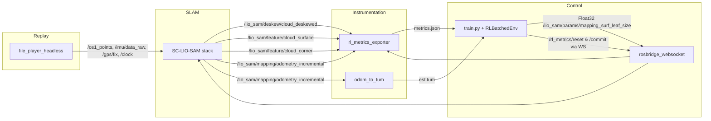

# ROS Integration

## Nodes and Ownership
| Node | Package / File | Launch Context | Responsibility |
| --- | --- | --- | --- |
| ``file_player_headless`` | ``file_player_mulran/src/headless_player.cpp`` | Spawned by ``EpisodeOrchestrator`` via ``FILE_PLAYER_CMD`` | Replays MulRan sequence from ``--dir``, publishing lidar/IMU/GPS/radar and ``/clock`` at ``--rate``. Supports ``--start-percent`` seeks. |
| ``lio_sam`` stack | ``SC-LIO-SAM/SC-LIO-SAM`` | ``rl_vo/launch/lio_stack.launch`` (per episode) | Runs LOAM front-end + SC-LIO-SAM back-end. ``mapOptimization`` subscribes to parameter topic and emits ``/lio_sam/mapping/odometry_incremental``. |
| ``odom_to_tum`` | ``odom_to_tum.py`` | Spawned per episode | Subscribes to ``nav_msgs/Odometry`` and writes ``est.tum`` for evo scoring. |
| ``rl_metrics_exporter`` | ``metric_pkg/scripts/metrics_exporter.py`` | Started once by ``rl_vo/launch/core.launch`` | Aggregates scan, feature, odom, IMU stats; exposes ``/rl_metrics/reset`` & ``/commit`` services and writes ``metrics.json``. |
| ``rosbridge_websocket`` | ``rosbridge_server`` | ``core.launch`` | WebSocket bridge for all RL-to-ROS interactions. |
| ``train.py`` (RL host) | ``rl_vo/train.py`` + ``env/rosbridge_client.py`` | Runs outside ROS | Calls rosbridge services, publishes Float32 actions, consumes ``metrics.json`` and ``est.tum``. |

## Topics
| Topic | Msg Type | Publisher → Subscriber | Notes |
| --- | --- | --- | --- |
| ``/os1_points`` | ``sensor_msgs/PointCloud2`` | file_player → SC-LIO-SAM | Main lidar stream. |
| ``/lio_sam/feature/cloud_surface`` | ``sensor_msgs/PointCloud2`` | SC-LIO-SAM → rl_metrics_exporter | Used for surf point counts & planarity tokens. |
| ``/lio_sam/feature/cloud_corner`` | ``sensor_msgs/PointCloud2`` | SC-LIO-SAM → rl_metrics_exporter | Used for corner stats. |
| ``/lio_sam/deskew/cloud_deskewed`` | ``sensor_msgs/PointCloud2`` | SC-LIO-SAM → rl_metrics_exporter | Provides total points per scan + scan timestamps. |
| ``/lio_sam/mapping/odometry_incremental`` | ``nav_msgs/Odometry`` | SC-LIO-SAM → rl_metrics_exporter & odom_to_tum | Drives odom rate, velocity features, and TUM logging. |
| ``/imu/data_raw`` | ``sensor_msgs/Imu`` | file_player → rl_metrics_exporter | Supplies angular/linear RMS metrics. |
| ``/gps/fix`` | ``sensor_msgs/NavSatFix`` | file_player → SC-LIO-SAM navsat | Optional, ensures navsat module receives GNSS. |
| ``/radar/polar`` | ``sensor_msgs/Image`` | file_player → external (unused by RL) | Available for completeness. |
| ``/lio_sam/params/mapping_surf_leaf_size`` | ``std_msgs/Float32`` | train.py (rosbridge) → SC-LIO-SAM ``mapOptimization`` | Primary RL action channel; metrics exporter subscribes to record ``action_last``. |
| ``/clock`` | ``rosgraph_msgs/Clock`` | file_player → ROS sim time | Keeps ROS sim time consistent. |

## Services
| Service | Type | Provider | Consumer | Purpose |
| --- | --- | --- | --- | --- |
| ``/rl_metrics/reset`` | ``std_srvs/Trigger`` | ``rl_metrics_exporter`` | ``EpisodeOrchestrator.begin_episode`` | Clears Welford accumulators & time-series buffers at episode boundaries. |
| ``/rl_metrics/commit`` | ``std_srvs/Trigger`` | ``rl_metrics_exporter`` | ``EpisodeOrchestrator.commit_metrics`` | Forces exporter to dump latest stats to ``/tmp/rlvo/metrics.json``. |

## Parameters and Config
- ``rosbridge_port``: argument passed to ``core.launch``; ``RLBatchedEnv`` builds ``ws://localhost:<port>`` URLs (``config/config.yaml``).
- ``metrics_out_file``: defaults to ``/tmp/rlvo/metrics.json``; both exporter and env agree on the same path.
- ``file_player`` CLI arguments come from Hydra config (``file_player.rate_hz`` etc.) and environment overrides. ``start_percent`` is randomised between ``start_percent_min``/``start_percent_max`` each episode.
- ``SC-LIO-SAM`` reads MulRan-specific params by loading ``$(find lio_sam)/config/params_mulran.yaml`` in ``lio_stack.launch``.

## ROS Graph Diagram

